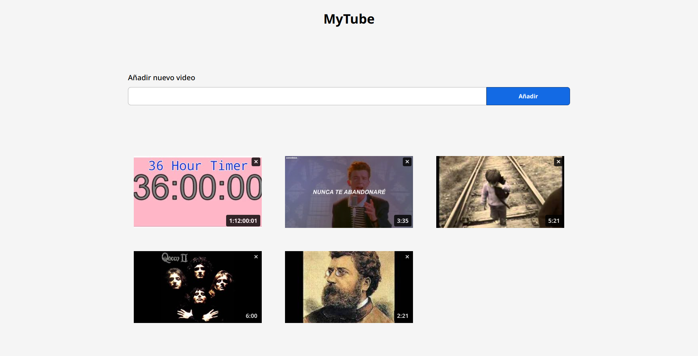
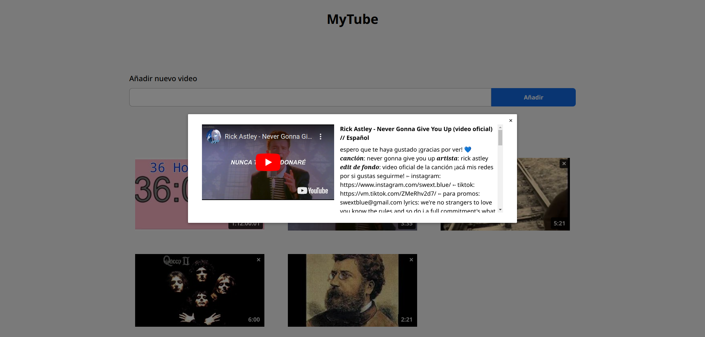
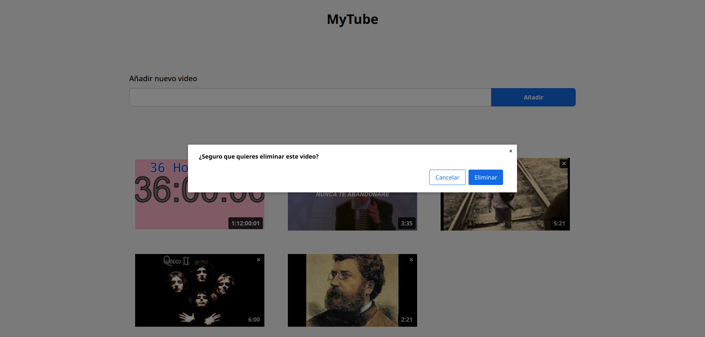

# MyTube

Proyecto demo que permite crear un álbum de videos de YouTube.

## Características

- Permite agregar videos al álbum usando su URL.
- Permite ver los detalles de un video y reproducirlo.
- Permite eliminar videos del álbum.
- La lista de videos es almacenada en la nube.

## Limitaciones

- No hay cuentas. La lista es común a todos los usuarios.

## Demo

El sitio se encuentra disponible en "https://mytube-jfgodoy.netlify.app".

## Tecnologías usadas

- API YouTube
- API Firebase
- Vite
- Vitest
- Vue 3
- TypeScript
- UnoCss

## Capturas de pantalla

### Vista principal

### Modal detalles de video

### Modal eliminar video

